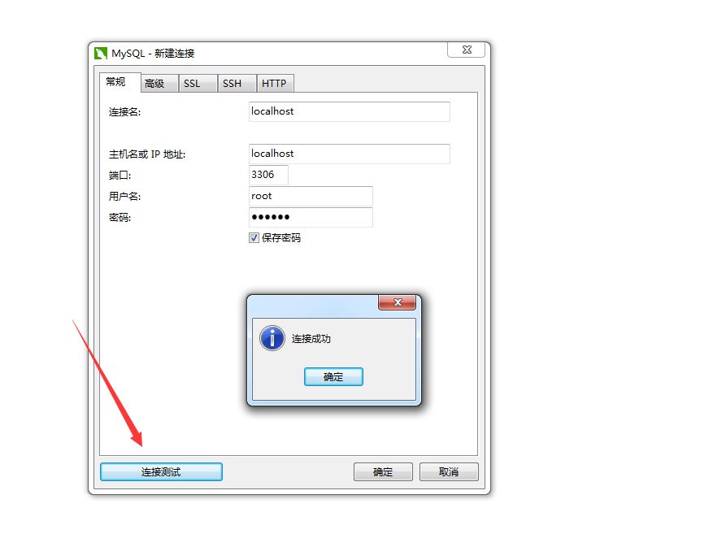
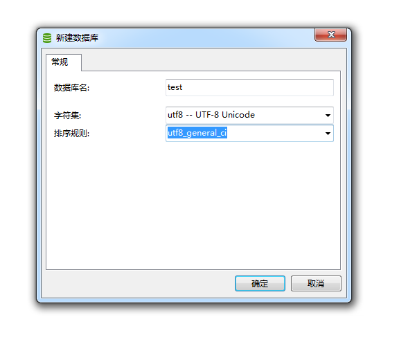

## 0、写在前面
作为一个切图仔，这是我个人写的第一个全栈项目:smile:，之前看了点node相关的视频本来准备后端用原生node的，后来转念一想，干脆直接上框架吧，正好可以顺便多学一个框架于是就现学现卖的上了koa2.x，感觉写接口也不是那么难啊:smirk:，前端就用的目前比较主流的vue + element，之所以想写这么一个项目是因为我之前从来没从头到尾的写过一个完整的vue项目，都是接手的前人的代码，写这个项目正好可以巩固一下之前学的技术  
线上预览地址：http://94.191.2.25

## 1、技术栈
前端：vue2 、 vuex 、 vue-router 、 axios 、 webpack 、 ES6 、 stylus 、 element-ui


后端：node 、koa2 、 mysql

### 1.1 组件库
项目内含有多个自主开发的组件，直接应用于实际工作中。
+ toDoList 
+ 上传组件
+ 瀑布流组件


## 2、项目结构

### 2.1前端项目结构


```
├──  build                               
├──  config                              
├──  node_modules                          
├──  src                                    ---核心代码目录
|   ├──  assets                            
|   |    ├── images                         ---静态资源存放目录
|   ├──  common                             ---字体图标存放目录
|   ├──  components                         ---组件存放目录
|   ├──  pages                              ---页面存放目录(可复用的则封装为组件，不可以的写为页面)
|   ├──  router                             ---路由
|   ├──  store                              ---vuex相关的文件
|   ├──  tools                              
|   |    ├── index.js                       ---封装了一些常用的函数
|   ├── App.vue                           
|   ├── main.js                          
├── .eslintrc                               ---自定义eslint配置文件
├── package.json     
......                                      ---其他一些vue脚手架生成的文件就不表述了
```

### 2.2后端项目结构

```                       
├──  api                                    ---接口目录
|   ├──  spider                             ---爬虫相关的接口(开发中...)
|   ├──  upload                             ---上传文件相关的接口
|   ├──  user                               ---用户相关的接口                 
├── common                                  
|   ├──  tool.js                            ---封装了一些常用的函数
|   ├──  mysql.js                           ---连接数据库的js(文件你们是看不到的，因为里面有线上数据库的账户密码，不过我给你们留了一个连接数据库示例哦，看在我这么贴心的份上还不快点个star:）)
|   ├──  mysqlDemo.js                       ---这就是连接数据库示例了(clone下来后，记得把文件名改为mysql.js哦)
├── upload                                  ---文件上传的路径
├── app.js                                  ---入口文件
├── test.sql                                ---数据库表的设计结构(里面数据全被截断了)
├── package.json                                
```

## 3、快速部署


### 3.1首先把项目代码clone下来
```
git clone https://github.com/xypecho/vue-full-stack-project.git
```


### 3.2 配置mysql环境
首先在cmd里面执行一下`mysql`命令看看,
  
如果出现了以上的输出则跳过该步骤，直接进入**3.2.2**,如果输出了其他内容则意味着你正在使用的这台电脑并没有安装mysql，要先安装mysql。

#### 3.2.1 下载配置mysql
首先去google或者百度下载`mysql 5.7`最好是下载5.7版本的，因为之前我下载的最新版，各种连接不上...,一顿操作成功安装之后再去cmd执行下`mysql`，不出意外输出的肯定是  
  
这是因为没有配置环境变量，把`MySQL Server 5.7`下的`bin`路径添加到**系统变量**里面。然后再去cmd执行`mysql`，如果输出3.2里截图的信息则说明安装成功。


#### 3.2.2 连接数据库
去google或者百度下载`Navicat`，然后点击连接数据库，输入图片内内容(如果你的mysql密码是123456的话)  
  
连接成功后，右击`新建数据库`，按照下图中填写  
  
在新建的`test`数据库上右击选中`运行SQL文件`，选择`vue-full-stack-project\backend`下的`test.sql`,至此完成了数据库的连接


### 3.3安装npm包 & 运行项目
```
cd vue-full-stack-project
cd fontend
npm install     // 首先安装前端的依赖包
npm run dev     // 运行前端项目

cd ../          //回到根目录即vue-full-stack-project
cd backend
npm install     // 安装后端的依赖包
export NODE_ENV=development;           // 这个命令是为了区分不同的环境来读取不同的配置
node app.js     // 运行后端项目
```

以上就是快速部署的全过程了，此项目适合node & vue新人学习，如果此项目对你产生帮助，请点个star哦:blush:
